# Benchmark of a6f3561-1, main-26c71a6-1, travis-work-851bf83-1, travis-work-38456db-1, travis-work-a4e57af-1, travis-work-d6a369f-1
## General Info & Checks
|Check|a6f3561-1|main-26c71a6-1|travis-work-851bf83-1|travis-work-38456db-1|travis-work-a4e57af-1|travis-work-d6a369f-1|
|---|---|---|---|---|---|---|
|Docker image size (MB)|**115**|**111**|**111**|**115**|**115**|**115**|
|Does not start with invalid mongodb connection string|Bad, did not exit in 15s|Bad, did not exit in 15s|Bad, did not exit in 15s|Bad, did not exit in 15s|Bad, did not exit in 15s|Bad, did not exit in 15s|
|Does not start without env variables|Good, exited in 0.2s|Good, exited in 0.2s|Good, exited in 0.2s|Good, exited in 0.2s|Good, exited in 0.2s|Good, exited in 0.2s|
|HTTP GET / returns 200 or 404|Good|Good|Good|Good|Good|Good|
|HTTP GET /fnhjkdniudsancyne returns 404|Good|Good|Good|Good|Good|Good|
|HTTP GET /v1/rtfb_status returns 404|Good|Good|Good|Good|Good|Good|
|HTTP GET /v1/rtfb_status/{not-a-uuid} returns 404|Good|Good|Good|Good|Good|Good|
|HTTP GET /v1/rtfb_status/{uuid} returns 200 and correct object|Good|Good|Good|Good|Good|Good|
|Service logs a message containing 3030 (used port) on startup|Good|Good|Good|Good|Good|Good|
|Service logs every request, message contains url path|Good|Good|Good|Good|Good|Good|
|Startup time (to start responding) secs|**0.00591**|**0.00435**|**0.00322**|**0.00479**|**0.00332**|**0.00405**|
|Stops gracefully|Bad, did not stop in 15.4s|Bad, did not stop in 15.4s|Bad, did not stop in 15.4s|Bad, did not stop in 15.4s|Bad, did not stop in 15.4s|Bad, did not stop in 15.4s|
|Threads with 1 online vCPU, 1.0 soft CPU limit|**liftright-data-**|**None**|**None**|**None**|**liftright-data-**|**liftright-data-**|
|Threads with 2 online vCPUs, 2.0 soft CPU limit|**liftright-data-**|**None**|**None**|**None**|**liftright-data-**|**liftright-data-**|
## Graphs
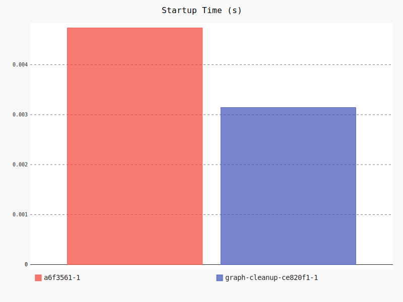
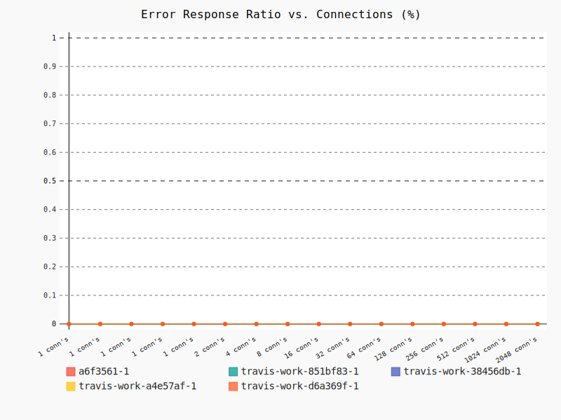
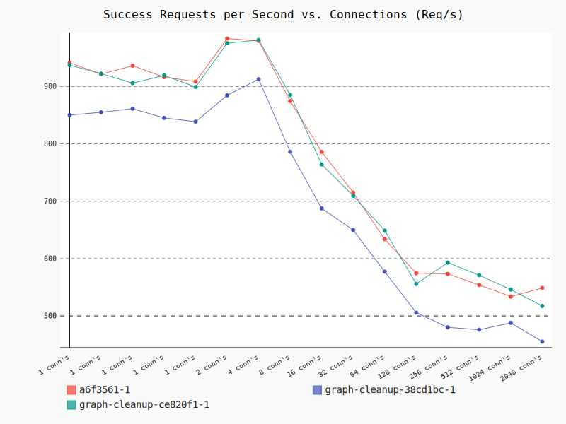
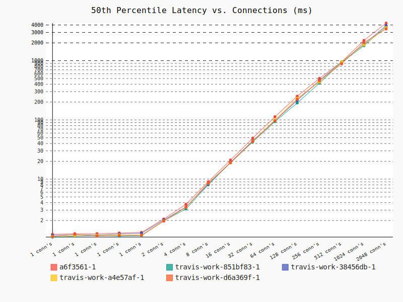
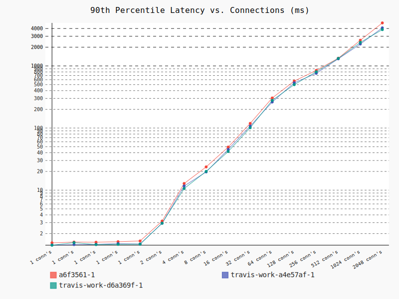
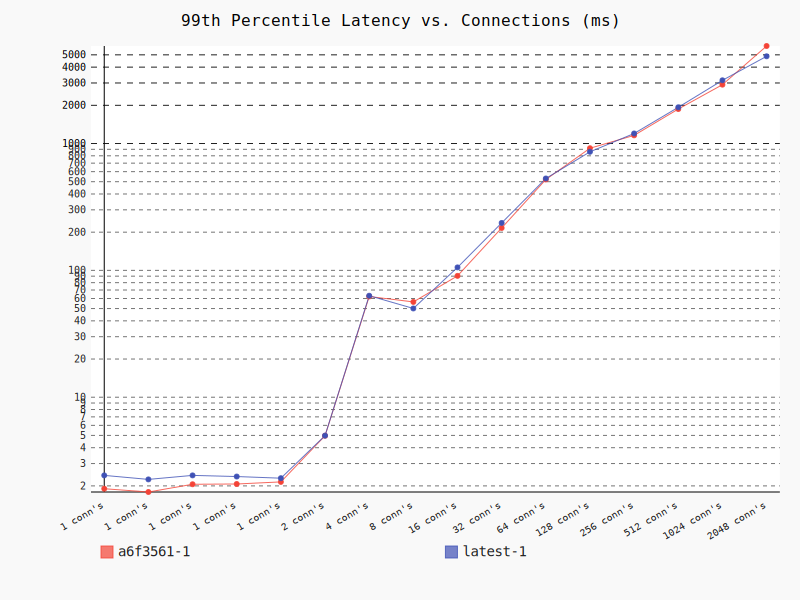
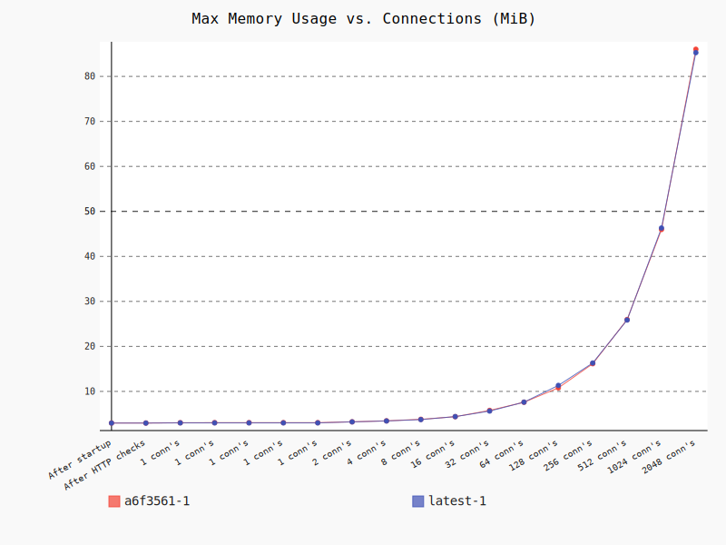
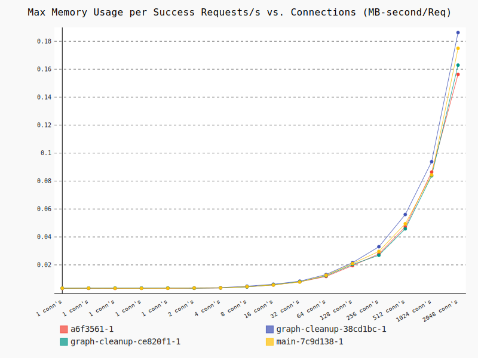
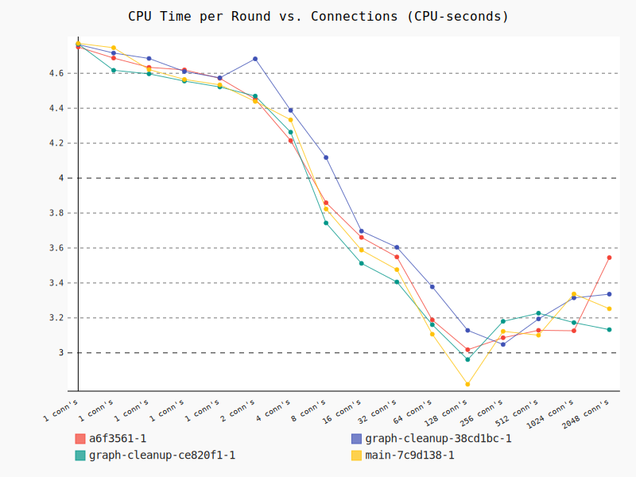
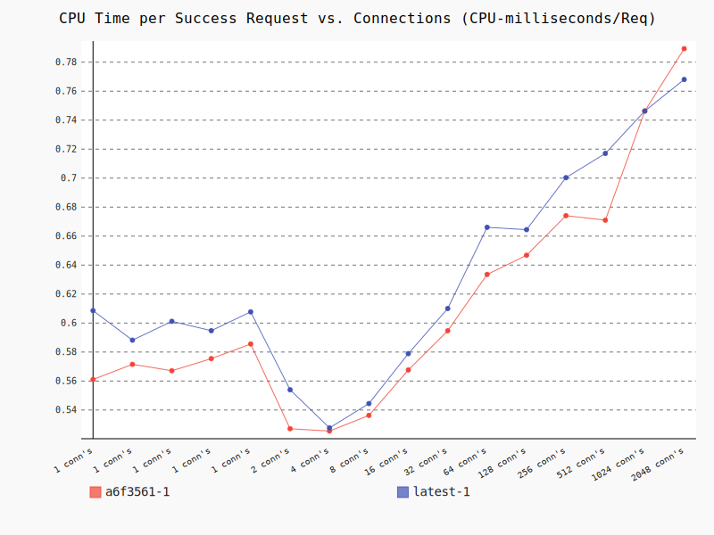
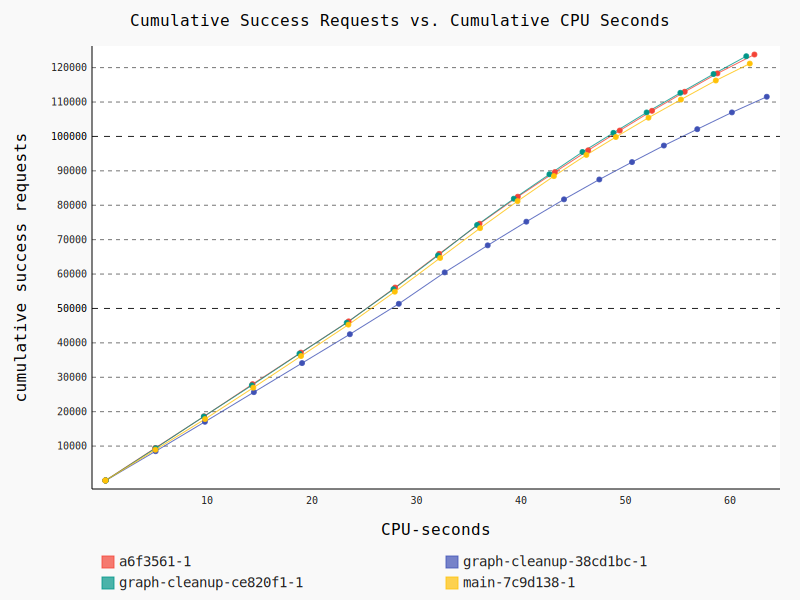
