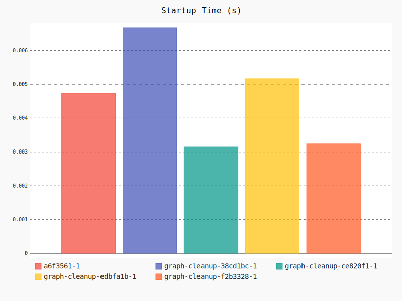
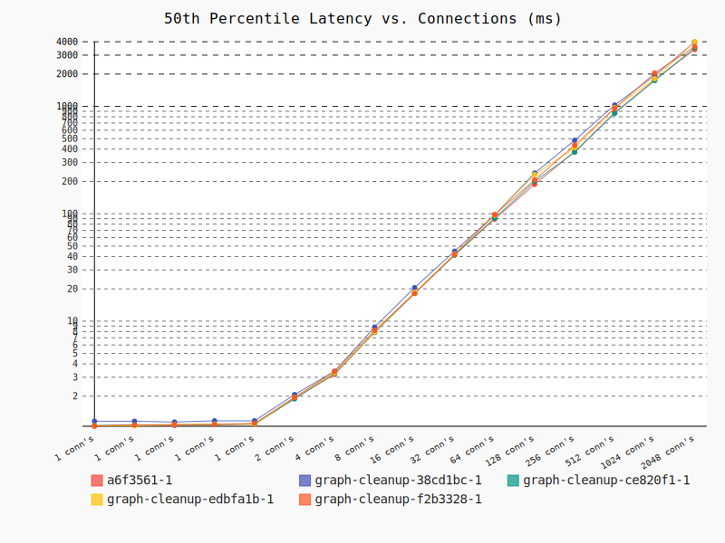
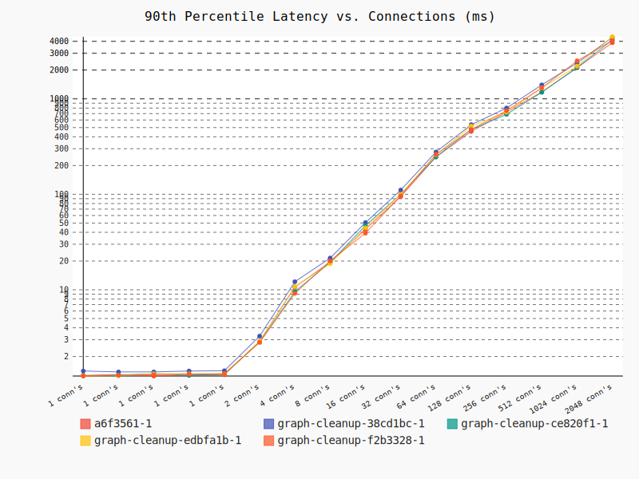
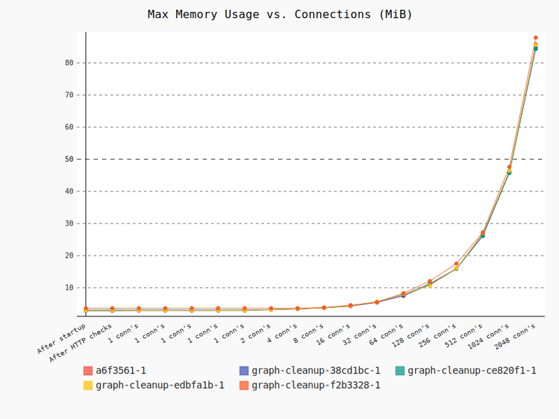
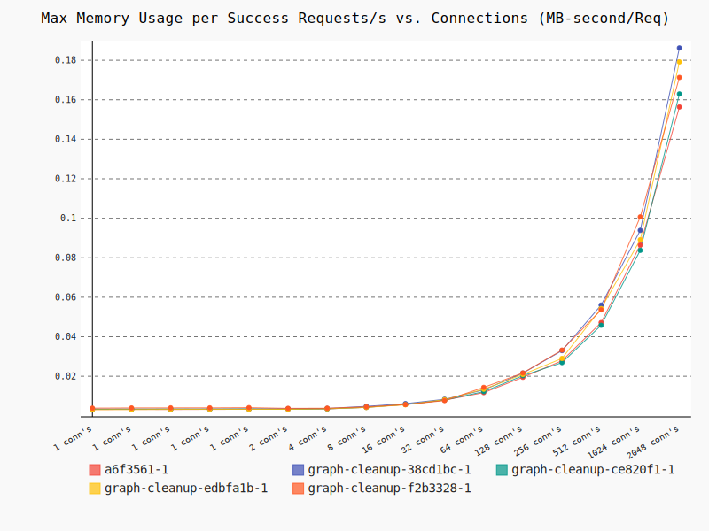
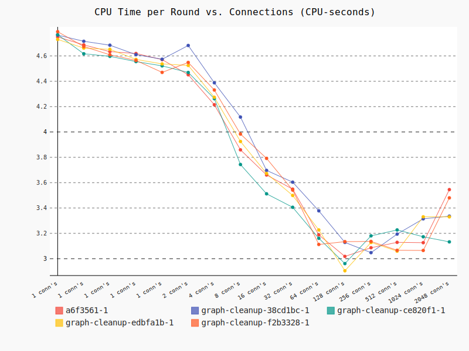
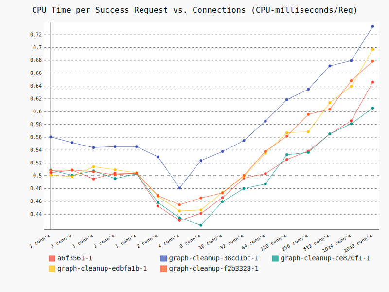
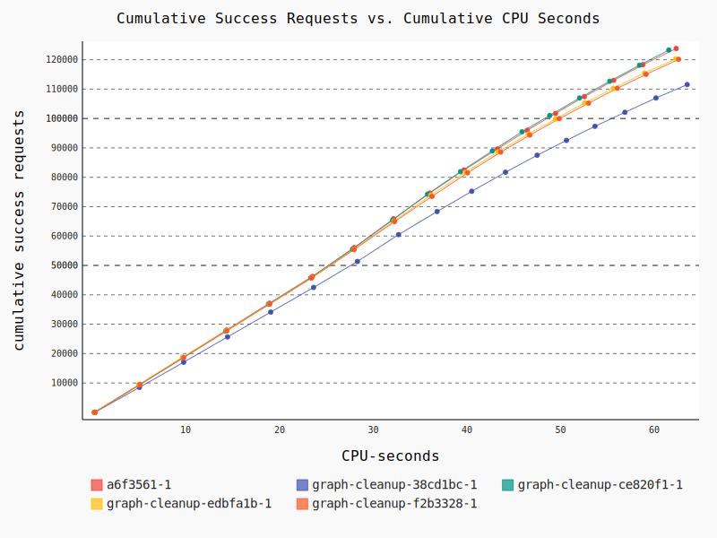

# Benchmark of a6f3561-1, graph-cleanup-38cd1bc-1, graph-cleanup-ce820f1-1, graph-cleanup-edbfa1b-1, graph-cleanup-f2b3328-1
## General Info & Checks
|Check|a6f3561-1|graph-cleanup-38cd1bc-1|graph-cleanup-ce820f1-1|graph-cleanup-edbfa1b-1|graph-cleanup-f2b3328-1|
|---|---|---|---|---|---|
|Docker image size (MB)|111|111|111|111|111|
|Does not start with invalid mongodb connection string|Bad, did not exit in 15s|Bad, did not exit in 15s|Bad, did not exit in 15s|Bad, did not exit in 15s|Bad, did not exit in 15s|
|Does not start without env variables|Good, exited in 0.2s|Good, exited in 0.2s|Good, exited in 0.2s|Good, exited in 0.2s|Good, exited in 0.2s|
|HTTP GET / returns 200 or 404|Good|Good|Good|Good|Good|
|HTTP GET /fnhjkdniudsancyne returns 404|Good|Good|Good|Good|Good|
|HTTP GET /v1/rtfb_status returns 404|Good|Good|Good|Good|Good|
|HTTP GET /v1/rtfb_status/{not-a-uuid} returns 404|Good|Good|Good|Good|Good|
|HTTP GET /v1/rtfb_status/{uuid} returns 200 and correct object|Good|Good|Good|Good|Good|
|Service logs a message containing 3030 (used port) on startup|Good|Good|Good|Good|Good|
|Service logs every request, message contains url path|Good|Good|Good|Good|Good|
|Startup time (to start responding) secs|**0.00474**|**0.00668**|**0.00314**|**0.00516**|**0.00324**|
|Stops gracefully|Bad, did not stop in 15.4s|Bad, did not stop in 15.4s|Bad, did not stop in 15.4s|Bad, did not stop in 15.4s|Bad, did not stop in 15.4s|
## Graphs

